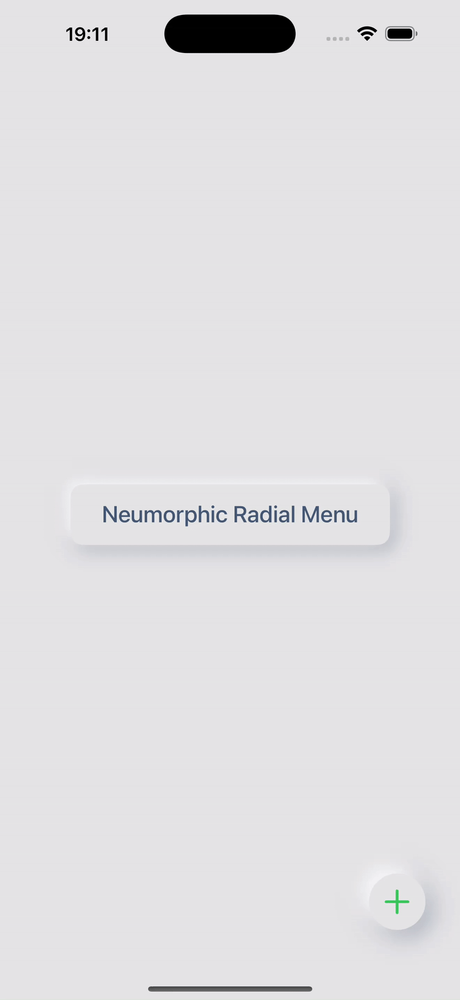

# SwiftUI Neumorphic Radial FAB

[](https://developer.apple.com/xcode/swiftui/)
[](https://developer.apple.com/ios/)
[](LICENSE)

A customizable Neumorphic-style Floating Action Button (FAB) with radially expanding menu options, built purely in SwiftUI. This project showcases custom button styling, animations, and Neumorphic design principles.

## Demo

<p align="center">
  
</p>

## ✨ Features

*   **Neumorphic Design:** Soft UI styling for the main FAB, option buttons, and an example title container.
*   **Concave "Pressed" State:** Main FAB visually presses in when expanded, simulating an inner shadow.
*   **Radial Expansion:** Smooth, staggered animation for menu options appearing in an arc.
*   **Customizable Options:** Easily define menu items with unique SF Symbols icons, icon colors, and actions.
*   **Flexible Styling:** Neumorphic parameters (colors, shadow offsets, blurs) are adjustable.
*   **Pure SwiftUI:** Built entirely with SwiftUI, leveraging `ButtonStyle` and `ViewModifier`.

## 🛠️ Requirements

*   iOS 15.0+
*   Xcode 13.0+

## 🚀 How to Use

1.  **Add Files to Your Project:**
    *   Copy the main `NeumorphicRadialMenu/` folder (which contains `Extensions/`, `FABComponents/`, and `Neumorphism/`) into your Xcode project. Ensure all Swift files within these subfolders are included in your app's target.

    The key files you'll need are:
    *   `NeumorphicRadialMenu/Extensions/Color+Extensions.swift`
    *   `NeumorphicRadialMenu/FABComponents/MenuOption.swift`
    *   `NeumorphicRadialMenu/FABComponents/NeumorphicRadialFAB.swift`
    *   `NeumorphicRadialMenu/Neumorphism/NeumorphicColors.swift`
    *   `NeumorphicRadialMenu/Neumorphism/SimpleNeumorphicButtonStyle.swift` (or `NeumorphicButtonStyle.swift`)
    *   `NeumorphicRadialMenu/Neumorphism/NeumorphicViewModifier.swift`

2.  **Integrate into Your View:**

    ```swift
    import SwiftUI

    struct MyView: View {
        let menuOptions: [MenuOption] = [
            MenuOption(iconName: "pencil", iconColor: .blue, action: { print("Edit Tapped") }),
            MenuOption(iconName: "trash", iconColor: .red, action: { print("Delete Tapped") }),
            MenuOption(iconName: "square.and.arrow.up", iconColor: .green, action: { print("Share Tapped") })
        ]

        var body: some View {
            ZStack(alignment: .bottomTrailing) {
                // Your screen's main content
                NeumorphicColors.background.ignoresSafeArea() // Set the Neumorphic background

                VStack {
                    Spacer()
                    Text("My App Content")
                    Spacer()
                }

                // Add the FAB
                NeumorphicRadialFAB(options: menuOptions)
                    .padding(30) // Adjust padding as needed
            }
        }
    }
    ```

## 🎨 Customization

*   **Colors & Shadows:** Modify `NeumorphicRadialMenu/Neumorphism/NeumorphicColors.swift` and the parameters within the ButtonStyle files (e.g., `SimpleNeumorphicButtonStyle.swift`) and `NeumorphicViewModifier.swift` to change the look and feel.
*   **FAB Options:**
    *   Change `expansionRadius`, `optionButtonSize`, `mainButtonSize` in `NeumorphicRadialMenu/FABComponents/NeumorphicRadialFAB.swift`.
    *   Adjust the `offsetForOption` function for different arc spreads or option layouts.
*   **Icons:** Uses SF Symbols. Provide valid system image names in your `MenuOption` instances.

## 🔑 Key SwiftUI Concepts Demonstrated

*   Custom `ButtonStyle` for reusable Neumorphic effects.
*   `ViewModifier` for applying Neumorphic styles to generic views.
*   `@State` for managing UI state (e.g., FAB expansion).
*   SwiftUI `Animation` (springs, delays) for smooth transitions.
*   `ZStack` for layering UI elements.
*   Trigonometry for radial layout calculations.

## 💡 Future Enhancements (To-Do)

*   [ ] Add haptic feedback on tap and expansion.
*   [ ] Option for different expansion animations (e.g., linear, different spring parameters).
*   [ ] More robust inner shadow simulation for the concave state.
*   [ ] Accessibility improvements (labels, dynamic type support).

## 📄 License

This project is licensed under the MIT License
